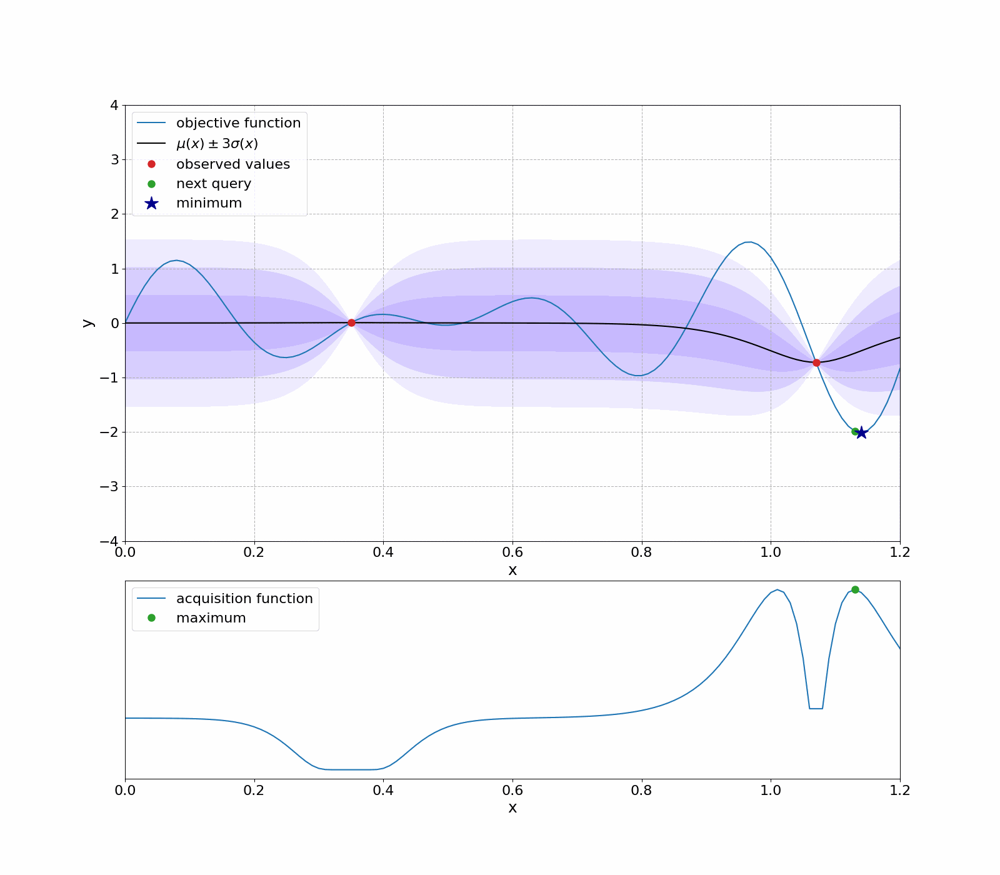
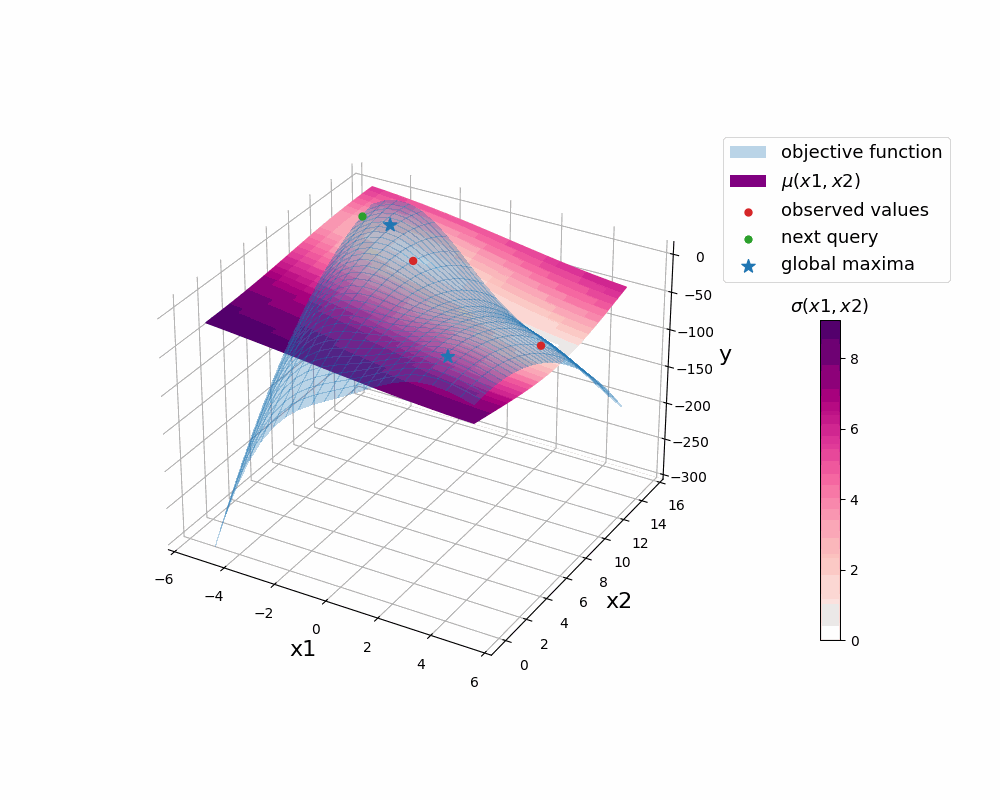

# Bayesian Optimization using Gaussian Process: Implementation from Scratch

## Authors:
- [Eugenio Fella](https://github.com/eugeniofella)
- [Theivan Pasupathipillai](https://github.com/TheivanPasu)
- [Matteo Pedrazzi](https://github.com/matteopedrazzi)
- [Gaetano Ricucci](https://github.com/gae-ric)
- [Carlo Sgorlon Gaiatto](https://github.com/carlosgorlongaiatto)

## Results:
Bayesian optimization of a 1D analytical function:

  

  
Bayesian optimization of a 2D analytical function (negative Branin-Hoo function):

  

